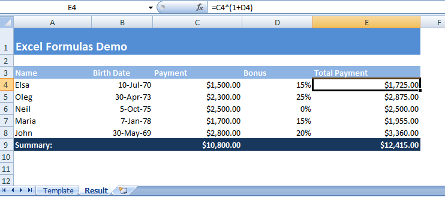
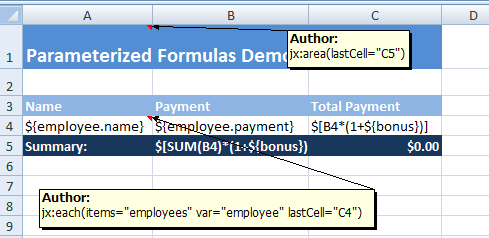
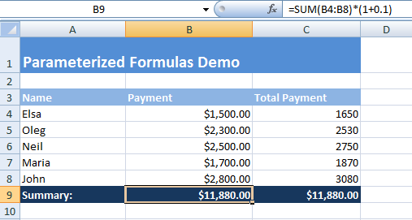

# Excel 标准公式

Jxls-2.x 支持标准 Excel 公式，在报表模板中使用它们时不需要任何特殊语法( Jxls 1.x 不支持)。

### Java 代码

在 XLS Area 中渲染公式，必须要在主转换完成后调用 **XlsArea** 实例的 **processformula()** 方法。
在调用 **processformula()** 方法时，Jxls 引擎将根据需要对可能的单元格移动和集合展开进行计数来处理并渲染所有更新它们的模板公式。

Java 的主要实现代码如下：

```java
Area xlsArea;
Context context;
// construct XLS Area and set it into xlsArea var
// ...
// fill in context var with data
// ...
// apply XLS Area at A1 cell of 'Result' sheet
xlsArea.applyAt(new CellRef("Result!A1"), context);
// process area formulas
xlsArea.processFormulas();
// save excel output
// ...
```

在 **xlsa.processformula()** 行代码中完成所有的公式处理工作。

### 公式模板

我们可以从[Excel 公式样例](http://jxls.sourceforge.net/samples/excel_formulas.html)中获取一个带公式的模板文件。

[下载模板](http://jxls.sourceforge.net/xls/formulas_template.xls)

下面是模板的截图


你能在模板中看到有 **E4** , **C5** , **E5** 三个公式单元格。

单元格 **E4** 本身是 **jx:each** 指令区域的一部分，它包含一个公式 **=C4*(1+D4)** 。

**C4** 和 **D4** 单元格都属于同一个 **jx:each** 指令区域。

在 **jx:each** 转换之后，**A4:E4** 区域将被扩展为多个行。

原始公式 **=C4*(1+D4)** 将对每一行进行相应的修改，从而得到 **=C5*(1+D5)** ， **=C6*(1+D6)** 等公式。

单元格 **C5** **=SUM(C4)** 中的求和公式从 **jx:each** 命令区域内部引用单元格 **C4** 。
这意味着经过转换和公式处理对单元格 **C4** 的引用后，将替换为一个类似索引范围的公式 **SUM(C4:C8)**。

单元格 **E5** 也是如此，公式 **=SUM(E4)**。

以下为 Excel 最终的输出结果截图



### 公式处理器

默认情况下，当调用 **processformula()** 方法时，Jxls 使用 **FastFormulaProcessor** 处理模板中的公式。这个类使用了简化的公式处理算法，运行速度非常快。

但在某些情况下，当存在复杂的模板或非常规的处理时，可能会产生无效的结果。在这种情况下，您应该切换到 **StandardFormulaProcessor** ，它使用了不同的公式处理算法，且可靠性强。

想要切换到 **StandardFormulaProcessor** ，代码如下：

```java
xlsArea.setFormulaProcessor(new StandardFormulaProcessor()); 
```

必须在调用 **processformula()** 方法之前设置公式处理器。

请注意，**StandardFormulaProcessing** 的执行速度大约是 **FastFormulaProcessing** 的 10 倍，
所以如果您正在处理数千个公式(例如，您在每个命令区域中都有一个公式，它处理大量的集合)，您可能会看到性能下降

### 默认公式值

如果在处理过程中删除参与公式计算的单元格，则公式值可能会损坏或未定义。
为了避免这种情况，从 **v.2.2.8** **Jxls** 开始，将该公式设置为 **=0** 。
如果您要为这些公式使用自定义默认值，请使用 **jx:params** 注释设置 **defaultValue** 属性。例如：

```text
jx:params(defaultValue="1")
```

这样就可以将默认公式值设置为1。

### 参数化公式

参数化公式允许您在公式中使用上下文变量。

要设置参数化的公式，必须将其封装到 **$[** 和 **]** 符号中，每个公式变量必须封装在 **$\{** 和 **}** 符号中。例如 **$[SUM(E4) * ${bonus}]** 。
这里我们在公式中使用了‘ bonus ’上下文变量。在 **processformula()** 期间，Jxls 将使用上下文中的值替换所有变量。

##### 1、样例数据

在本例中，我们将使用与[输出对象集合](http://jxls.sourceforge.net/samples/object_collection.html)说明中相同的 **Employee** 对象。

```java
public class Employee {
    private String name;
    private int age;
    private Double payment;
    private Double bonus;
    private Date birthDate;
    private Employee superior;

    // getters/setters
    // ...
}
```

##### 2、报告模板

本例的[报表模板](本例的报表模板如下所示)如下所示：



##### 3、Java 代码

在本例中，我们将使用 Jxls POI 适配器生成报告。Java 代码与 [Excel 公式示例](http://jxls.sourceforge.net/samples/excel_formulas.html)中的代码相同，
只是我们将 **bonus** 变量放到了上下文中。

```java
   List<Employee> employees = generateSampleEmployeeData();
    try(InputStream is = ParameterizedFormulasDemo.class.getResourceAsStream("param_formulas_template.xls")) {
        try (OutputStream os = new FileOutputStream("target/param_formulas_output.xls")) {
            Context context = new Context();
            context.putVar("employees", employees);
            context.putVar("bonus", 0.1);
            JxlsHelper.getInstance().processTemplateAtCell(is, os, context, "Result!A1");
        }
    }
```

##### 4、输出的 Excel 文件

下面的截图显示了这个示例的最终[报告](http://jxls.sourceforge.net/xls/param_formulas_output.xls)



### 单元格引用跟踪

在执行区域转换时，Jxls 跟踪所有经过处理的单元格，以便了解每个特定源单元格的目标单元格。
如果您没有或不需要处理这些公式，那么禁用此功能来减少内存的使用。
可以通过在上下文配置中设置以下配置参数来实现：

```java
Context context = new PoiContext();
context.getConfig().setIsFormulaProcessingRequired(false);
```

> [原文地址](http://jxls.sourceforge.net/reference/grid_command.html)
