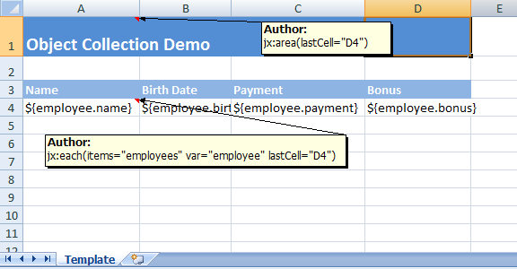

# XLS Area（矩形区域）

### 简介

**XLS Area** 是 **Jxls** 中的一个重要概念。基本上它表示 Excel 文件中需要转换的矩形区域。
每个 **XLS Area** 可能有一个与之关联的转换指令（ **Command** ）集和一组嵌套的子区域。
每个子区域也是一个 **XLS Area** ，具有自己的一组命令和嵌套区域。
顶级 **XLS Area** 是没有父区域的（它没有嵌套到任何其他 **XLS Area** 中）。

### 构建 XLS Area

Jxls 提供了三种方法可以构建 XLS Area

* 使用 Excel 标记构建 XLS Area

* 使用 XML 配置来构建 XLS Area

* 使用 Java API 来构建 XLS Area

接下来让我们详细描述这些方法。

##### 使用 Excel 标记构建 XLS Area

您可以在 Excel 模板中使用特殊的标记来构造 XLS Area 。标记应该放在该区域第一个单元格的 Excel 注释中。标记写法如下：

```text
jx:area(lastCell = "<AREA_LAST_CELL>")
```

其中 **<AREA_LAST_CELL>** 是定义区域的最后一个单元格。

这个标记定义了一个顶级区域，从带有标记注释的单元格开始，以 **<AREA_LAST_CELL>** 结束。

要查看示例，让我们查看[输出集合对象示例](http://jxls.sourceforge.net/samples/object_collection.html)中的模板：



如上图，在 **A1** 单元格的注释中定义了一个区域，如下：

```text
jx:area(lastCell="D4")
```

这里我们定义了一个覆盖 **A1:D4** 单元格范围的区域。

我们可以使用的 **XlsCommentAreaBuilder** 类，解析标记并创建 **XlsArea** 对象，如下所示：

```java
// getting input stream for our report template file from classpath
InputStream is = ObjectCollectionDemo.class.getResourceAsStream("object_collection_template.xls");
// creating POI Workbook
Workbook workbook = WorkbookFactory.create(is);
// creating JxlsPlus transformer for the workbook
PoiTransformer transformer = PoiTransformer.createTransformer(workbook);
// creating XlsCommentAreaBuilder instance
AreaBuilder areaBuilder = new XlsCommentAreaBuilder(transformer);
// using area builder to construct a list of processing areas
List<Area> xlsAreaList = areaBuilder.build();
// getting the main area from the list
Area xlsArea = xlsAreaList.get(0);
```

其中，以下两行代码完成了区域构建的所有主要工作

```java
AreaBuilder areaBuilder = new XlsCommentAreaBuilder(transformer);
List<Area> xlsAreaList = areaBuilder.build();
```

首先，通过实例化 **XlsCommentAreaBuilder** 来构造一个 **AreaBuilder** 实例。第二步是调用 **areabuier.build()** 方法，从模板中解析构造一个区域对象列表。

获得顶级区域列表之后，就可以使用它们进行 Excel 转换。

##### 使用 XML 配置来构建 XLS Area

如果您更喜欢使用 XML 标记定义 **XLS Area**，可以使用以下方法。

首先，您必须创建一个 XML 配置来定义您的区域。

让我们用一个简单的 XML 配置来实现 [XML 构建输出集合对象](http://jxls.sourceforge.net/samples/object_collection_xmlbuilder.html)

```xml
<xls>
    <area ref="Template!A1:D4">
        <each items="employees" var="employee" ref="Template!A4:D4">
            <area ref="Template!A4:D4"/>
        </each>
    </area>
</xls>
```

根元素是 **xls** ，然后可以列出定义的每个顶级区域的 **area** 元素。

在这个例子中，我们的模板中有一个顶级区域，它表示了名称为 **Template** 的工作簿，作用区域为 **A1:D4** 。

```html
<area ref="Template!A1:D4">
```

在这个区域内，我们可以使用特定元素来表示特定的指令，并且定义相关的指令集。
在本例中，我们使用 **each** xml 元素定义 **each command** 。 用 **ref** 属性表示 **each command** 作用的区域。如下：

```html
<each items="employees" var="employee" ref="Template!A4:D4">
```

在 **each command** 内，我们有一个嵌套区域参数如下：

```html
<area ref="Template!A4:D4"/>
```

##### 使用 Java API 来构建 XLS Area

如果您想要使用 **Java API** 创建 **XLS Area** ，可以使用 **XlsArea** 类的构造函数来创建。可以使用以下构造函数：

```java
public XlsArea(AreaRef areaRef, Transformer transformer);

public XlsArea(String areaRef, Transformer transformer);

public XlsArea(CellRef startCell, CellRef endCell, Transformer transformer);

public XlsArea(CellRef startCellRef, Size size, List<CommandData> commandDataList, Transformer transformer);

public XlsArea(CellRef startCellRef, Size size);

public XlsArea(CellRef startCellRef, Size size, Transformer transformer);
```

要构建顶层区域，您必须提供一个 **Transformer** 实例，以便该区域可以使用它进行转换。

您必须使用单元格范围作为字符串定义区域单元格，或者创建 **CellRef** 单元格引用对象并设置区域 **Size** 。

下面是用指令集构造的一组嵌套模板 **XLS Area** 的代码片段

```java
// create Transformer instance
// ...
// Create a top level area
XlsArea xlsArea = new XlsArea("Template!A1:G15", transformer);
// Create 'department' are
XlsArea departmentArea = new XlsArea("Template!A2:G13", transformer);
// create 'EachCommand' to iterate through departments
EachCommand departmentEachCommand = new EachCommand("department", "departments", departmentArea);
// create an area for employee 'each' command
XlsArea employeeArea = new XlsArea("Template!A9:F9", transformer);
// create an area for 'if' command
XlsArea ifArea = new XlsArea("Template!A18:F18", transformer);
// create 'if' command with the specified areas
IfCommand ifCommand = new IfCommand("employee.payment <= 2000",
        ifArea,
        new XlsArea("Template!A9:F9", transformer));
// adding 'if' command instance to employee area
employeeArea.addCommand(new AreaRef("Template!A9:F9"), ifCommand);
// create employee 'each' command and add it to department area
Command employeeEachCommand = new EachCommand( "employee", "department.staff", employeeArea);
departmentArea.addCommand(new AreaRef("Template!A9:F9"), employeeEachCommand);
// add department 'each' command to top-level area
xlsArea.addCommand(new AreaRef("Template!A2:F12"), departmentEachCommand);
```

### [原文地址](http://jxls.sourceforge.net/reference/xls_area.html)
